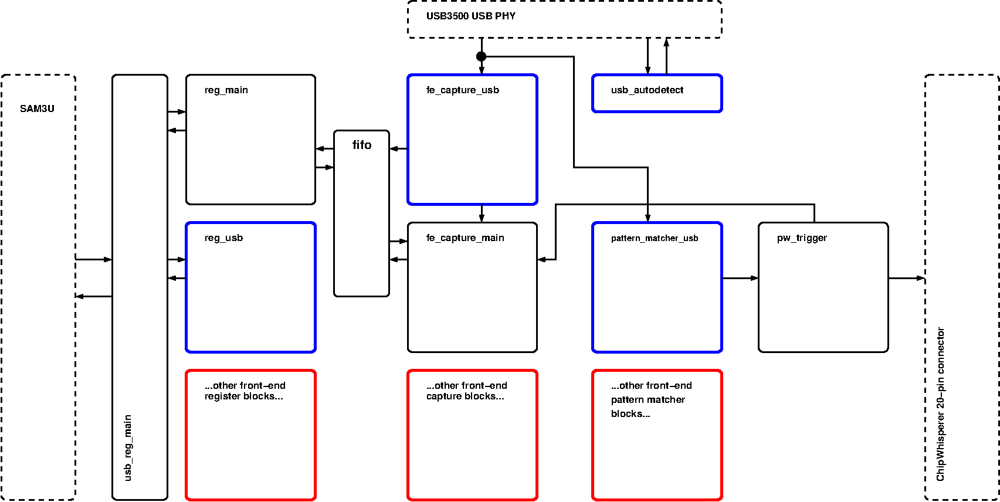

# FPGA Hierarchy

The PhyWhisperer-USB FPGA was architected in a way that facilitates plugging
in different frontends (i.e.  non-USB frontends, or maybe USB frontends with
different features).

The figure below shows the block diagram of its Verilog modules.
There are 9 modules in PhyWhisperer-USB. Some of these (e.g. the register
modules; the front-end modules) *could* have been combined into a single
module; they were separated to facilitate different front-ends.

Note that:
* Modules with black borders are generic interface-agnostic modules, which
  are meant to be used with all front-ends;
* Modules with blue borders are specific for the original PhyWhisperer-USB
  front-end;
* Modules with red borders illustrate what new modules would be required to
  accommodate new front-ends.
* Blocks with dashed borders are external to the PhyWhisperer FPGA.
* Not all connections between modules are shown.

A brief description of each module follows the block diagram.

## `usb_reg_main`
Front-end to the SAM3U interface, which provides host access to the
PhyWhisperer-USB.

## `reg_main`
Register module for interface-agnostic registers, including FIFO read data
and status. Register definitions are pulled from `defines_pw.v`.

## `reg_usb`
Register module for USB-specific registers. Register definitions are pulled
from `defines_usb.v`.

## `usb_autospeed`
Passively autodetects the USB speed negotiated between the target and the
host, so the that the PhyWhisperer's [USB
PHY](https://www.microchip.com/wwwproducts/en/USB3500) can be set to
properly passively decode USB traffic.

## `fe_capture_main`
Interface-agnostic front-end control logic; doesn't format the data writen
to the FIFO, but controls *when* data and timestamps are written to the FIFO.

## `fe_capture_usb`
Interface to the USB PHY; signals to `fe_capture_main` when there is data to
be written to the FIFO, and formats this data.

## `fifo`
Interface-agnostic, contains the large FIFO storage element. Written by
`fe_capture_usb`, read by `reg_main`; some control signals also interface
with `fe_capture_main` and `reg_usb`.

## `pattern_match_usb`
Looks for a masked pattern match, and when one is found, signals
`pw_trigger` to initiate trigger generation and data capture.

## `pw_trigger`
Interface-agnostic, issues a programmable number of programmable output
triggers upon seeing a pattern match from `pattern_match_usb`; also
initiates data capture to `fe_capture_main` (since this is timed to coincide
with the first output trigger).

